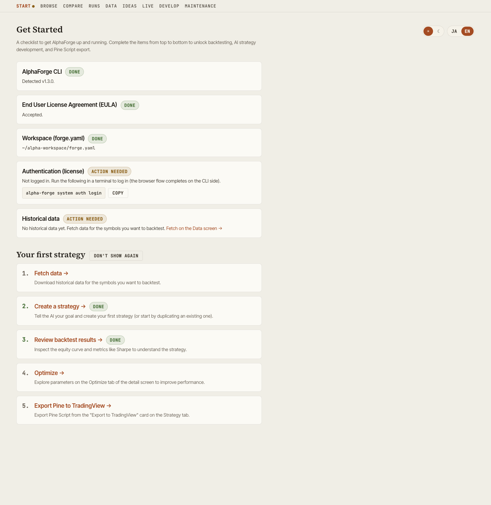
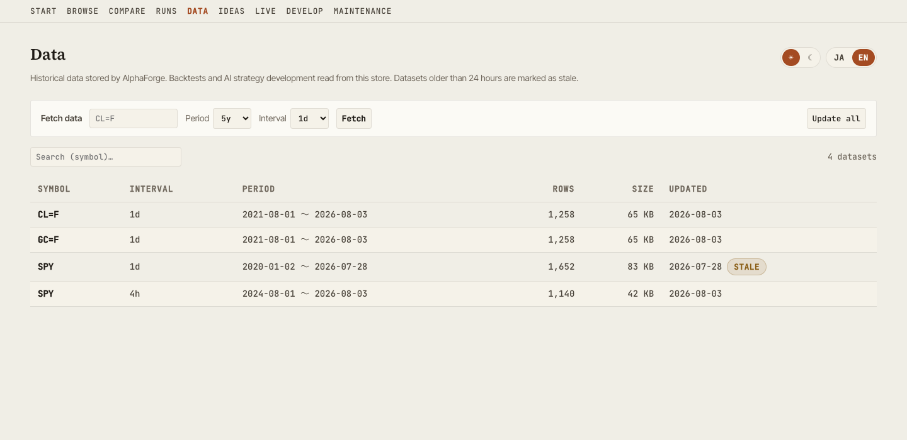

# Features

Walkthrough of each dashboard screen served by `alpha-vis serve`.

## Get Started

Shows first-run setup status and guides you to your first strategy. Available at `/start`, and from the "Start" link at the head of the header nav.

{ loading=lazy }

### Setup checklist

`GET /api/setup/status` aggregates the following five checks. Each incomplete item shows a concrete next step (a copyable command, or a link inside the GUI).

| Check | What is verified | Guidance when incomplete |
|---|---|---|
| AlphaForge CLI | `alpha-forge` command detection and version | Link to the installation guide |
| End User License Agreement (EULA) | Whether the EULA has been accepted | Run `alpha-forge system doctor` in a terminal and accept it there (**it cannot be accepted from this screen**) |
| Workspace (forge.yaml) | Whether the server can resolve a forge.yaml | Run `alpha-forge system init` and restart with `--forge-dir` |
| Authentication (license) | Login state and plan | Run `alpha-forge system auth login` in a terminal (the browser flow completes on the CLI side) |
| Historical data | Whether any datasets exist | Link to the Data screen |

A failure in one check never breaks the whole screen — only that item is shown as "unknown". Once everything is in place, a completion banner appears with links to AI strategy development and Browse. While setup is incomplete, the "Start" nav item carries an attention dot.

### First-strategy guide

Below the checklist, a five-step guide (fetch data → create a strategy → review backtest results → optimize → export Pine to TradingView) walks you to your first success. Steps are marked "Done" based on actual data (datasets, strategies, runs), and once at least one strategy exists, the later steps link directly to the relevant detail tabs. The guide can be hidden with "Don't show again" (persisted in the browser) and restored at any time.

## Browse

Strategy library with search. Strategies sharing a name, symbol, and timeframe are rolled up into a single "recipe" row; expand a row to see the individual parameter variants. Includes the symbol coverage table, Saved Views (preset filters), and a groupable Strategy Ledger.

{ loading=lazy }

Key actions:

- Filter by symbol / timeframe / Sharpe tier
- Read recipe counts, run, and unrun per symbol in the symbol coverage table (sorted by unrun descending by default, so the next symbol to backtest surfaces first). Click a row to filter by that symbol
- Save your favorite filter combinations as Saved Views
- Open the global command palette with `Cmd+K` / `Ctrl+K`
- Click a row to expand the slide panel, or jump to Detail

`selectedId` and `compareIds` are synchronized to URL query parameters, so a particular selection state can be shared via URL.

## Detail

Multi-faceted view of a single strategy's backtest.

{ loading=lazy }

Tabs:

| Tab | Contents |
|---|---|
| **Backtest** | Equity / Drawdown / Underwater / trade list / benchmark metrics (alpha, beta, IR, correlation) / annual returns. Carry-adjusted metrics recorded with `alpha-forge backtest run --carry` are shown as a dedicated card |
| **IS / OOS** | In-Sample vs Out-of-Sample metric comparison |
| **WFO** | Walk-Forward composite equity and per-window results. Also renders WFT runs optimized on metrics other than sharpe |
| **Optimize** | Grid optimization heatmaps and parameter-vs-metric scatter plots |
| **Run History** | List of past backtest runs. Tuning trial runs launched from the GUI are visually distinguished from regular runs |
| **Strategy** | Indicators, entry/exit rules, and risk management as structured tree, plus the parameter tuning panel |

## Running from the GUI and parameter tuning

alpha-visualizer does more than display results: **backtests, optimization, and Walk-Forward Tests can be executed from the browser**. GUI-launched backtests have been available for a while; v0.9.0 adds asynchronous optimization / WFT jobs and the parameter tuning loop, closing the whole strategy-development loop inside the GUI. This requires the AlphaForge CLI on the same machine as the server (without the CLI, the dashboard keeps working as a read-only viewer).

### Running backtests / optimization / WFT

- Re-run a backtest from the Detail screen with one click (the log tail and the new run appear immediately)
- Optimization (Optuna) and Walk-Forward Tests launch as **asynchronous jobs** with real-time log / progress streaming over SSE. Running jobs can be cancelled
- WFT jobs run with recording enabled (`--save`), so finished runs automatically appear in the WFO tab
- Concurrency and timeout are configurable via the `ALPHA_VIS_JOB_CONCURRENCY` / `ALPHA_VIS_JOB_TIMEOUT` environment variables (see [Configuration](configuration.md))

### Parameter tuning loop

The tuning panel on the Strategy tab supports an **edit → trial run → compare → explicit save** loop entirely in the GUI.

1. Edit parameters and launch a trial run (the original strategy definition is untouched — the run uses a temporary strategy file)
2. Compare the trial against existing backtest results side by side
3. Only when you are happy, press "Save" to write the parameters back to the strategy definition (explicit action only — nothing is written back automatically)

Tuning trial runs are visually distinguished from regular runs in Browse, Run History, and the Backtest tab, so exploration footprints never mix with adopted results.

### Duplicate-based strategy creation

Clone an existing strategy under a new ID and register it as a new strategy — useful for iterating on parameters and rules while keeping the original as a template (conflicting IDs are rejected).

## Compare

Side-by-side view of multiple strategies.

{ loading=lazy }

{ loading=lazy }

- Parallel metric cards (CAGR / Sharpe / Sortino / MaxDD / Profit Factor, etc.)
- Overlaid equity curves
- Pearson correlation heatmap (normalized to overlapping period)

## Optimize

Visualize optimization results.

{ loading=lazy }

- Scatter plot (parameter vs. metric) and a two-parameter × metric heatmap, switchable via tabs (pick the X/Y parameters and the target metric; cell color = mean metric value for that parameter combination, hover shows the parameter pair, mean, and trial count)
- Walk-Forward Test composite equity curve
- Per-window performance trajectory

## Strategy structure

Visualize the structure of a strategy JSON.

{ loading=lazy }

- Indicators and their parameters
- Entry / exit conditions
- Risk management (stop logic, position sizing)
- Target symbols and timeframe

### Export to TradingView (Pine Script)

The "Export to TradingView" card on the Strategy tab copies or downloads the strategy as TradingView Pine Script (v6), delegated server-side to `alpha-forge pine preview`.

- Before generating, the strategy's indicators are checked against the Pine conversion support table, and unsupported indicators are flagged before you press the button
- After generating, the card walks you through pasting into the TradingView Pine editor (open a chart → open the editor → paste → add to chart)

!!! note "Pine Script export requires a paid plan"
    Pine export is a paid-plan feature of AlphaForge (Lifetime / Annual / Monthly). Running it on a Trial plan shows an upgrade prompt. If you have already purchased but are treated as Trial, run `alpha-forge system auth login` in a terminal to authenticate.

## Live

Browse live / paper trading records and compare them against backtests. Accessible at `/live`, or via the "Live →" link in the Browse header.

- Lists every entry with live records (both per-strategy and combine portfolios)
- The selected entry is synced to the URL query (`?id=`) for sharing
- The "Refresh live data" button runs forge's `live refresh` (sync-events → data update → live replay) as an asynchronous job, showing progress inline; on completion, both the list and the detail view refetch automatically (`POST /api/live/jobs`)

### Per-strategy (trade-based)

Total trades, win rate, profit factor, max drawdown, and net PnL, compared with the period-aligned backtest with diffs.

### Combine portfolios (position-based)

Shown in four blocks, in the order an investor actually reads them — how much is it worth, is it beating the market, how did it get there, and what's actually held.

| Block | Contents |
|---|---|
| **KPI row** | Current Value (+ day change) / Total P&L (amount & %) / Current DD (+ days since peak) / Period / Excess vs Index / Excess vs Backtest. The two excess-return figures only appear when the matching comparison series is available |
| **Equity + drawdown chart** | Reuses the same TradingView chart from the Detail page, overlaying up to two comparison lines — an index bought-and-held over the same period, and the backtest combine — present only when `alpha-forge live replay` was run with `--benchmark` / `--compare` (live-only otherwise). Includes range toggles (1M/3M/6M/1Y/2Y/ALL) and an accessible data table |
| **Metrics cards (existing)** | Total return / CAGR / Sharpe ratio / max drawdown / volatility, each compared against the period-aligned backtest |
| **Holdings table** | Ticker / Qty / Avg cost / Last / Value / Weight / Unrealized P&L, plus Positions Subtotal / Cash / Total rows. **These are reconstructed from event logs, not queried live from the broker — the UI states this explicitly** |

Live records appear automatically once the event log recorded by [alpha-strike](https://github.com/alforge-labs/alpha-strike) (the OSS webhook execution server) is imported into `backtest_results.db` via the AlphaForge CLI (`alpha-forge live sync-events` → `live import-events` / `live replay`). See the [alpha-strike setup guide](../guides/alpha-strike-setup.md) for the full import procedure.

!!! note "Combine portfolio missing from the list on an old database"
    `benchmark_equity` / `backtest_equity` / `positions` / `cash` / `total_value` were added as later column migrations. On a database that hasn't had `live replay` run against it since upgrading alpha-forge, the corresponding combine portfolio can vanish entirely from the `/live` list. Running `alpha-forge live replay` once adds the missing columns, after which it shows up as usual.

!!! note "Refresh is localhost-only and requires `live.replay` in forge.yaml"
    Because "Refresh live data" involves network access and DB writes, it is disabled when `alpha-vis serve` is bound to a non-loopback host (e.g. `--host 0.0.0.0`) — the list and detail views remain viewable. There is no parameter input; the `forge.yaml` `live.replay` section (see [`alpha-forge live refresh`](../cli-reference/live.md#alpha-forge-live-refresh)) is the source of truth. Older forge versions without `live refresh` support show a not-supported notice instead.

## Data

Lists stored historical datasets with freshness, and lets you fetch or bulk-update data from the GUI. Available at `/data`, and from the "Data" link in the header nav.

{ loading=lazy }

- Dataset list (symbol, interval, range, rows, size, last updated). The list is delegated to `alpha-forge data list`; datasets older than 24 hours are marked "Stale"
- Fetch a symbol (with period and interval) or incrementally update all stored datasets. Both run as asynchronous jobs with SSE progress logs and can be cancelled
- Screens that hit missing data (no_data) and the AI develop view link here with the symbol pre-filled

!!! note "Fetching and updating are localhost-only"
    Because they involve network access and file writes, fetch/update are disabled when `alpha-vis serve` is bound to a non-loopback host (e.g. `--host 0.0.0.0`). The list itself remains viewable.

## Ideas

Browse exploration ideas and their state.

{ loading=lazy }

- Filter by status (pending / exploring / promoted / archived, etc.)
- Filter by tag
- Linked strategies tie ideas to their implementations

## Develop

Runs AI-assisted strategy development from the GUI. Available at `/develop`, and from the "Develop" link in the header nav (shown after Live, before Maintenance). The "Develop" nav item appears whenever `alpha-vis serve` is bound to localhost (loopback, the default host). If neither `claude` nor `codex` is installed, the nav item and view are still shown, and the view displays an install-guidance card instead of the form.

Enter a free-text goal, an optional target symbol, and a backend (Claude Code / Codex CLI). This launches your locally installed `claude` / `codex` CLI headlessly as an asynchronous job to automatically: create a strategy JSON, validate it with `alpha-forge backtest run`, and show a link to the new strategy once it's done. Observing and cancelling the job uses the same mechanism as the run history screen.

**Input assistance and follow-up actions**

- **Goal builder**: pick a strategy type (trend following / mean reversion / breakout) and indicators to auto-draft a goal text (freely editable afterwards). The indicator choices are limited to those supported by Pine conversion, so exporting to TradingView later stays safe
- **Missing-data warning**: if the target symbol has no historical data, a warning appears before launch with a link to the Data screen (symbol pre-filled)
- **Next actions on completion**: the completion panel links to reviewing the new strategy's backtest, optimizing it, and comparing it with existing strategies

**AI-derived improvement of an existing strategy**

The "Improve with AI" card on the Detail screen (Strategy tab) lets you send an improvement instruction (e.g. trade less often, use tighter stops) that starts from an existing strategy. The agent reads the original and creates a **derived version under a new id** — **the original strategy is never modified**. On completion you can jump straight to a comparison against the original.

!!! warning "About external communication"
    This feature launches your own `claude` / `codex` CLI as-is. Those CLIs communicate with Anthropic / OpenAI. alpha-visualizer itself never handles, stores, or transmits API keys.

**Permission model**

- The agent only operates inside the forge workspace (claude: `--permission-mode dontAsk` + `--allowedTools "Read(//<workspace>/**),Edit(//<workspace>/**),Glob,Grep,Bash(alpha-forge *)"`; codex: `--sandbox workspace-write`)
- On the claude backend, file reads and writes are scoped to paths under the workspace, and anything outside is denied automatically (the `Edit` rule covers all file-editing tools, including Write). Note that this is the CLI's own permission check, not an OS-level sandbox like codex's `--sandbox workspace-write`
- The only shell command the agent can run is `alpha-forge`. Processes it starts inherit `FORGE_NONINTERACTIVE=1`, so alpha-forge's confirmation prompts for destructive operations are auto-confirmed — an accepted trade-off given that those operations stay inside the workspace
- If the server is bound to a non-loopback address (e.g. `alpha-vis serve --host 0.0.0.0`), this feature is disabled entirely, so it can't be used to run arbitrary-code-like operations over the LAN

**Prerequisites**

- `claude` (Claude Code) or `codex` (Codex CLI) must be on `PATH` and already authenticated
- `alpha-forge` must be installed
- **Known limitation of the codex backend**: `--sandbox workspace-write` blocks network access, so it cannot fetch price data for a symbol that isn't already cached (observed: it fails at DNS resolution). Run a backtest for the target symbol once beforehand to cache the data, or use the claude backend instead (claude restricts what tools the agent can run, but doesn't block the alpha-forge CLI's own network access)

**Environment variable**

| Variable | Role |
|---|---|
| `ALPHA_VIS_AGENT_TIMEOUT` | Timeout in seconds for an agent job (default `1800`). On timeout, the whole process tree is killed and the job is marked failed |
| `ALPHA_VIS_AGENT_MAX_TURNS` | Default turn limit (default `100`, claude only). The Develop view's "Turn limit" field overrides it per run (max `500`) |

**Turn limit**

The claude backend stops as soon as it reaches its turn limit (`--max-turns`), even in the middle of the work. The default is `100`, chosen so it roughly matches the timeout (1800 s by default) — measurements put one turn at about 17 seconds.

Exploratory goals that re-run backtests many times can hit the limit, so either raise "Turn limit (optional)" in the Develop view for that run, or split the goal into smaller steps. When a run is cut off this way, the error states that explicitly along with the limit that applied, and whatever the agent created so far stays in the workspace. The codex backend has no equivalent mechanism, so the field only appears when claude is selected.

**API**

| Method | Path | Description |
|---|---|---|
| `GET` | `/api/agent/backends` | Returns detection status (installed / version) for `claude` and `codex`, plus whether the feature itself is enabled (i.e. bound to loopback) |
| `POST` | `/api/agent/jobs` | Launches an agent job with a goal, optional symbol, and backend (returns 202; subsequent observation/cancellation is delegated to the existing `/api/jobs` endpoints). Passing `base_strategy_id` switches to derived-development mode starting from an existing strategy (404 if the base does not exist) |

## Maintenance

Lists "orphan" backtest results — runs whose strategy definition no longer exists in `strategies.db` — and lets you select and delete them. Accessible at `/maintenance`, or via the "Maintenance" link in the header nav.

- Listing: strategy ID, backtest run count, optimization run count, disk size, and last run timestamp
- Select rows to delete with checkboxes (nothing is selected by default)
- Deletion runs only after a confirmation dialog

!!! warning "Orphans are not necessarily unwanted data"
    Running `alpha-forge strategy delete` without `--with-results` removes only the strategy definition and intentionally keeps its results. So orphans include both "leftovers from deleted or renamed strategies" and "results kept on purpose." **Review carefully before deleting — deletion cannot be undone.**

Both listing and deletion are delegated to `alpha-forge backtest prune-orphans` on the server (alpha-visualizer does not determine orphans itself, to avoid mistakenly flagging built-in template strategies as orphans). This screen requires the AlphaForge CLI installed on the same machine as the server; if the CLI isn't found, an error with install instructions is shown.

!!! note "Not available on older alpha-forge versions"
    The `alpha-forge backtest prune-orphans` command this screen delegates to is only available in relatively recent alpha-forge versions. On a version that lacks `backtest prune-orphans`, the CLI reports the command as missing and the screen shows a message prompting you to update. Run `alpha-forge backtest prune-orphans --help` to check whether your installed version supports it.

## Cross-cutting features

### Global search (Cmd+K)

`Cmd+K` (macOS) / `Ctrl+K` (Windows / Linux) opens a command palette from any screen, letting you jump by strategy name or screen name.

### Theme toggle

Top-right toggle switches between dark and light. Preference is stored in browser localStorage.

### Language toggle

Switch UI between Japanese and English — useful for screenshots or sharing with international teammates.

### Export

- **CSV** — download trade history / metric tables from any panel
- **PNG** — save charts as static images
- **Share card** — export an OGP-sized (1200×630) PNG card from the Detail, Compare, and Live screens, combining the equity curve with the headline metrics — ready to post on X and other social media
- **Share on X** — one click saves the share card and opens the X post composer with a pre-filled performance summary (attach the saved image in the composer)
- **URL share** — Browse / Compare selection state is synced to query string, so copying the URL shares the view
