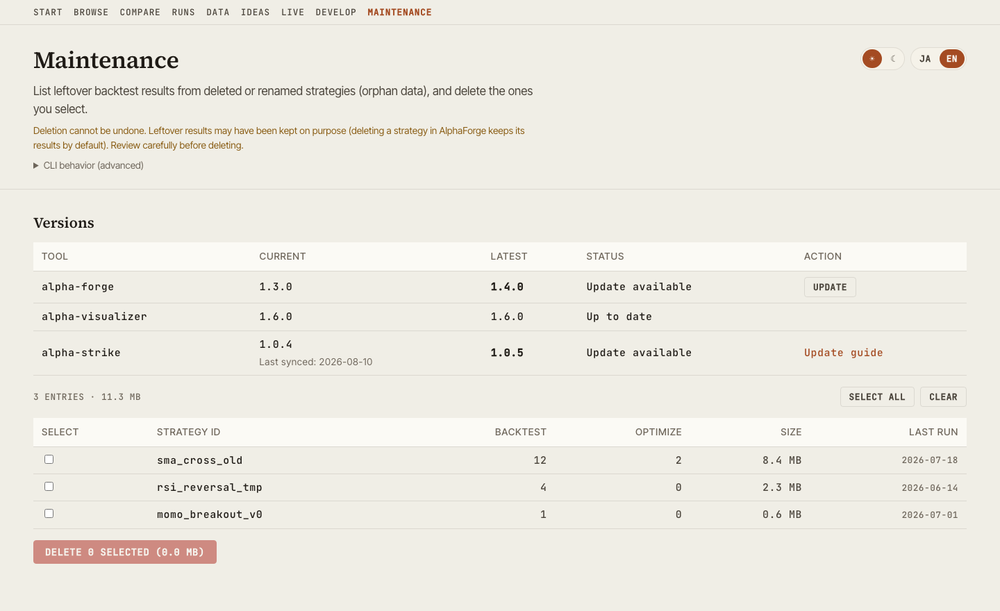

# alpha-visualizer v1.7.0 — Check and update your tool versions

> **Released**: August 10, 2026 / **Version**: v1.7.0 / **Distribution**: [PyPI](https://pypi.org/project/alpha-visualizer/) · [GitHub Release](https://github.com/alforge-labs/alpha-visualizer/releases/tag/v1.7.0)

[alpha-visualizer](index.md) is a standalone OSS package that visualizes `alpha-forge` backtest results in your browser. v1.7.0 makes it possible to tell, from the GUI, whether the tools you are using are out of date.

Until now version information was scattered across the UI, and every place only showed the version you already had installed. Finding out whether a newer release existed meant running a command for each tool.

## Highlights

### 1. A single list of versions

The Maintenance screen (`/maintenance`) gained a "Versions" section. The current and latest versions of alpha-forge, alpha-visualizer, and alpha-strike appear side by side in one table.

{ loading=lazy }

If a lookup fails, only that row shows "Unknown" — the other rows and the rest of the screen are unaffected. Being offline, or not having AlphaForge installed, is an expected state rather than a broken one, so it never breaks the screen.

### 2. Updating from the GUI

Rows with an available update get an "Update" button.

- **alpha-forge** — delegates to [`alpha-forge self update --yes`](../cli-reference/self.md). Download verification, the smoke test, and rollback are handled by AlphaForge itself
- **alpha-visualizer** — runs its own update via pip / uv, and restarts the server automatically **only when the update succeeds**, bringing the page back on its own

Progress is shown live while the update runs.

!!! warning "Self-update is not supported on Windows"
    The running `alpha-vis.exe` is locked, so pip cannot replace the file. On Windows the screen shows the update command instead.

### 3. alpha-strike is display-only

alpha-strike is a live order-execution server. To avoid restarting it from the GUI, no update button is shown — only a link to the update procedure.

The version shown is the one captured the last time [`alpha-forge live sync-events`](../cli-reference/live.md) ran, not a live value. The screen always shows "Last synced" alongside it so the value is never mistaken for real time.

!!! note "Requires alpha-strike v1.1.0 or later"
    The version travels as a metadata file that alpha-strike writes at startup and the existing sync path picks up. Deploy [alpha-strike v1.1.0](https://github.com/alforge-labs/alpha-strike/releases/tag/v1.1.0) or later to your VM and run `alpha-forge live sync-events` at least once. Until then the row shows "Unknown" with guidance.

## Safety limits

Updates can only be run **from localhost**. If you expose the server to your LAN (for example with `--host 0.0.0.0`), updating is disabled, because the API has no authentication.

The alpha-visualizer self-update refuses to start when any of the following applies:

- Another job is running (backtest, optimization, AI strategy development, …)
- The package is installed in editable (development) mode
- Neither pip nor uv is available

## Improvements

- **Added language and theme toggles to the Maintenance screen.** It was the only main screen without them, so switching meant navigating away
- **Fixed mismatched dark-mode colors.** When the OS color scheme was dark, the first render applied the light color tokens

## How to upgrade

```bash
# pip
pip install -U alpha-visualizer

# uv
uv tool upgrade alpha-visualizer

# pipx
pipx upgrade alpha-visualizer
```

From v1.7.0 you can also update from the "Update" button on the Maintenance screen (except on Windows).

## Related documentation

- [Features — Maintenance screen](features.md)
- [alpha-strike v1.1.0 release](https://github.com/alforge-labs/alpha-strike/releases/tag/v1.1.0)
