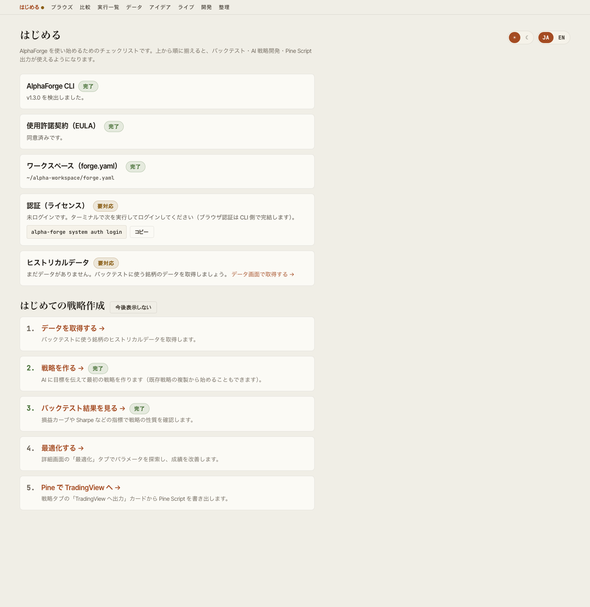
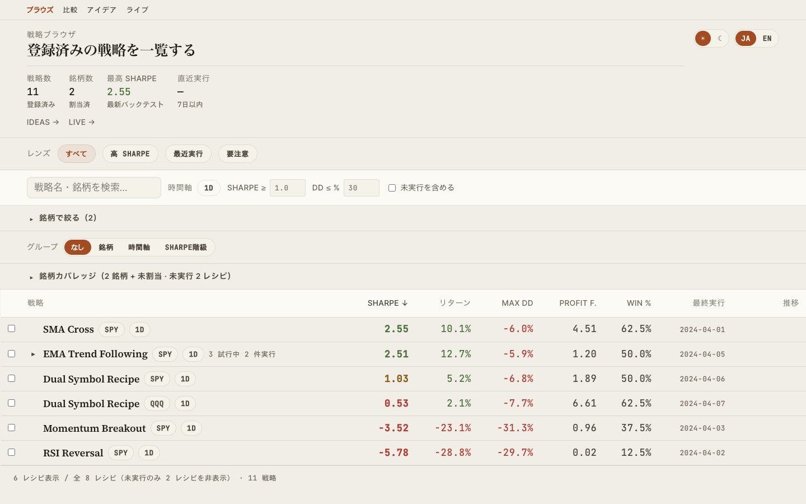
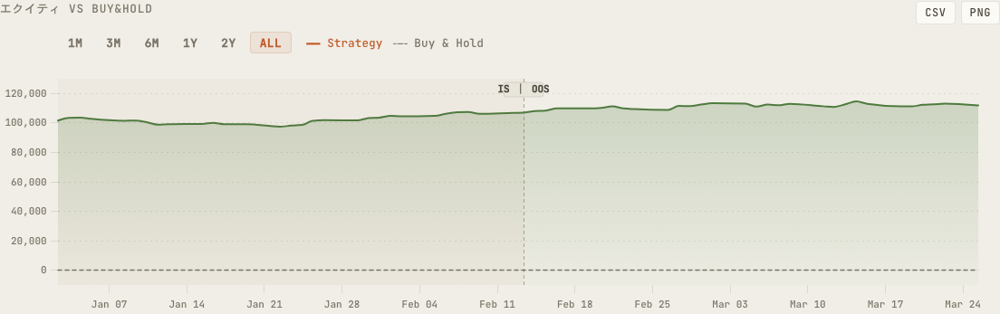
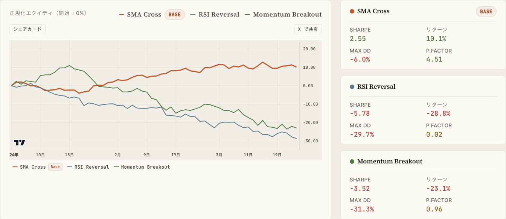
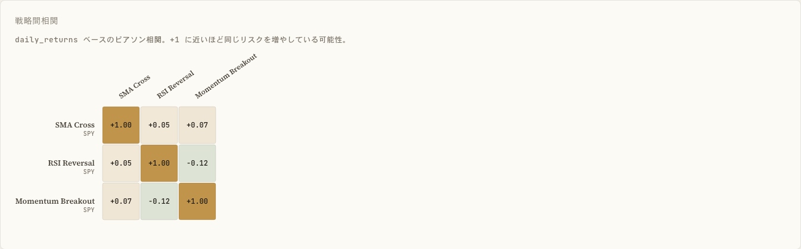
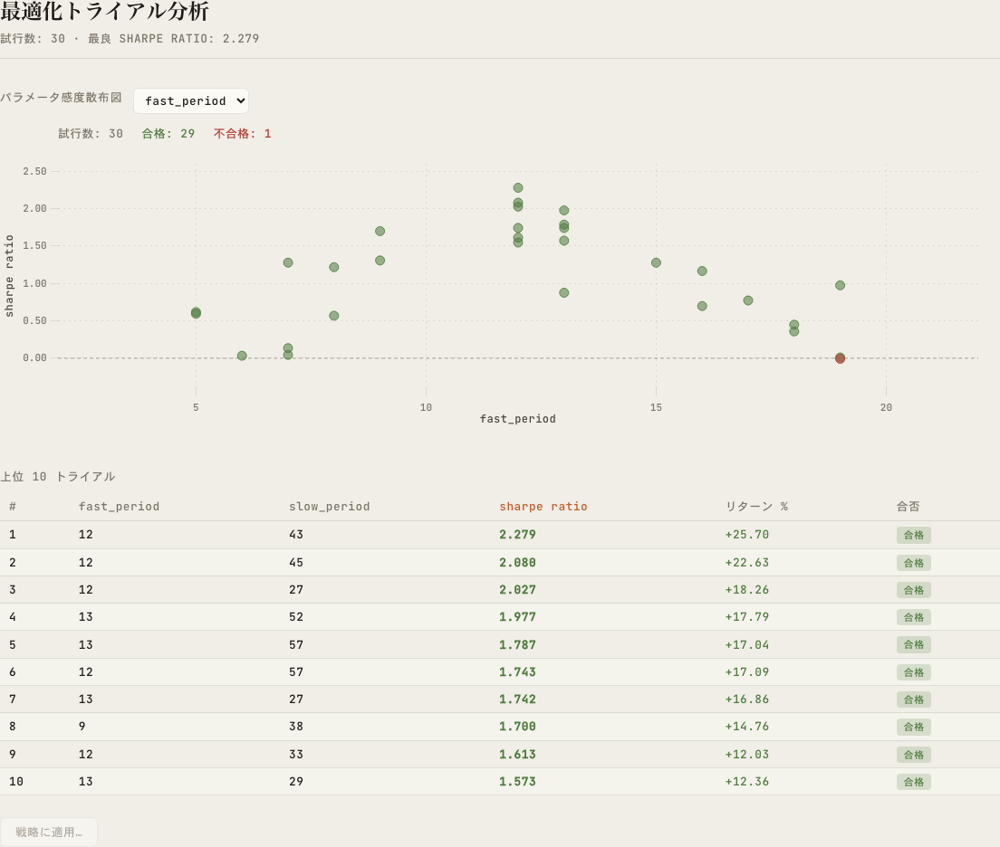
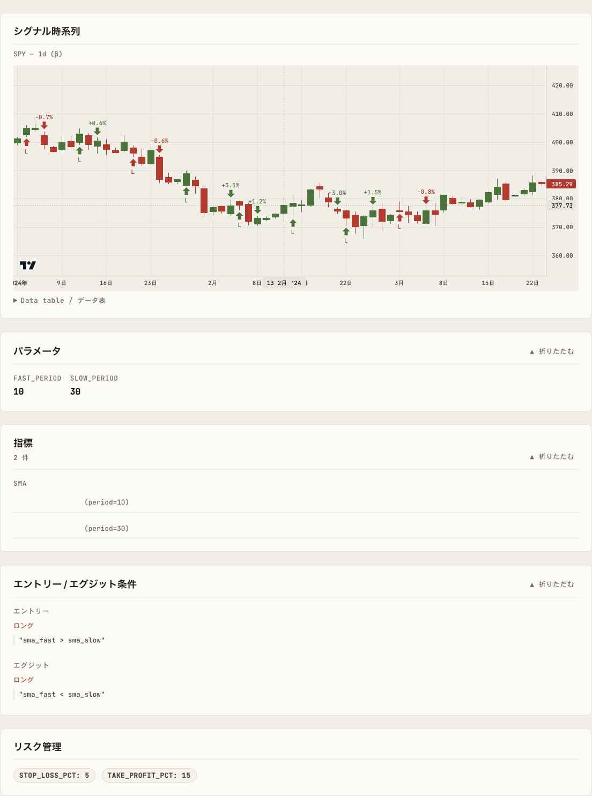
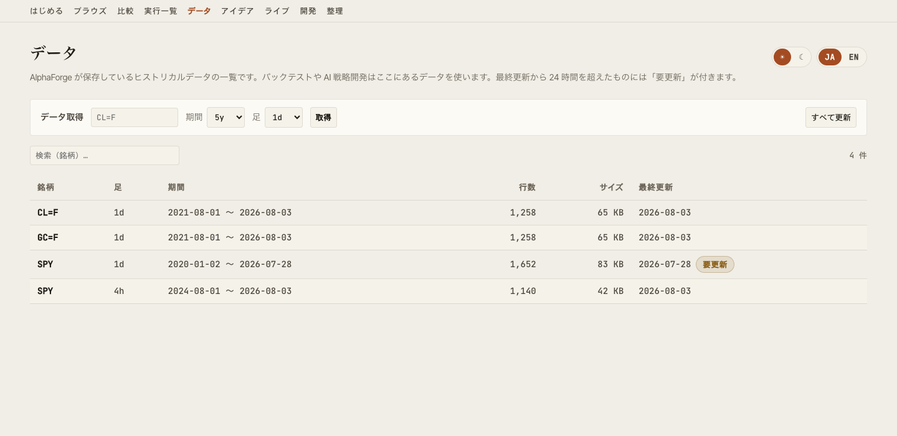
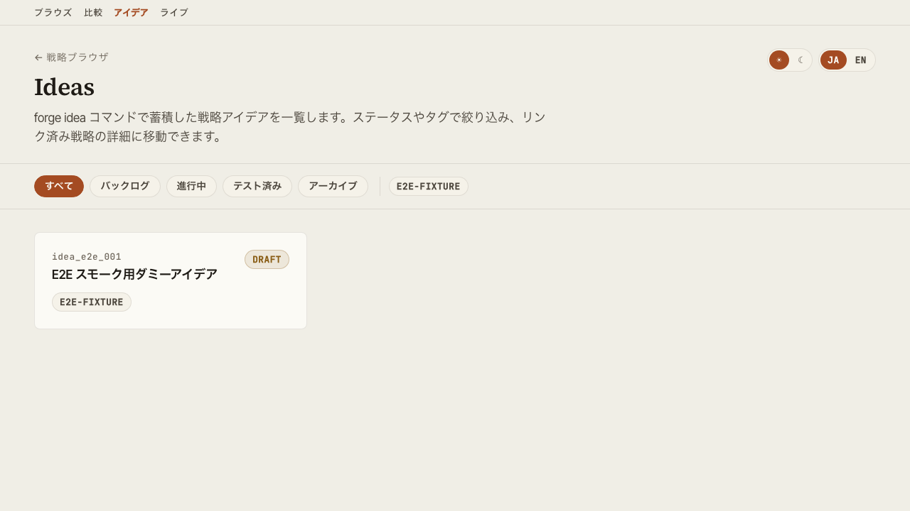

# 機能詳細

`alpha-vis serve` で起動するダッシュボードの各画面の役割を解説します。

## はじめる画面 { #start }

初回セットアップの状態確認と、最初の戦略作成までの道案内をする画面です。`/start` でアクセスでき、ヘッダーナビの先頭「はじめる」からも遷移できます。

{ loading=lazy }

### セットアップチェックリスト

`GET /api/setup/status` が次の 5 項目を集約判定し、未完了の項目には具体的な次の一手（コピー可能なコマンド、または GUI 内リンク）を表示します。

| チェック | 判定内容 | 未完了時の案内 |
|---|---|---|
| AlphaForge CLI | `alpha-forge` コマンドの検出とバージョン | インストールガイドへのリンク |
| 使用許諾契約（EULA） | 同意済みかどうか | `alpha-forge system doctor` をターミナルで実行して同意（**この画面から同意はできません**） |
| ワークスペース（forge.yaml） | サーバーが参照する forge.yaml が解決できているか | `alpha-forge system init` の実行と `--forge-dir` 指定の案内 |
| 認証（ライセンス） | ログイン状態とプラン | `alpha-forge system auth login` をターミナルで実行（ブラウザ認証は CLI 側で完結） |
| ヒストリカルデータ | 保有データの有無 | データ管理画面への導線 |

個別のチェックに失敗しても画面全体は壊れず、該当項目だけが「未確認」になります。すべて揃うと完了バナーと次の導線（AI 戦略開発・ブラウズ）が表示されます。未セットアップが検出されている間は、ヘッダーナビの「はじめる」に注意ドットが付きます。

### はじめての戦略作成ガイド

チェックリストの下に、最初の成功体験までの 5 ステップ（データ取得 → 戦略を作る → バックテスト結果を見る → 最適化する → Pine で TradingView へ）を表示します。データ・戦略・実行結果の有無から完了済みステップに「完了」が付き、戦略が 1 件でもあれば後半ステップはその戦略の該当タブへ直接遷移します。「今後表示しない」で非表示にでき（ブラウザに保存）、いつでも再表示ボタンで戻せます。

## Browse 画面

戦略ライブラリの一覧と検索。同名・同銘柄・同時間軸の戦略は 1 つの「レシピ」に畳まれ、行を展開するとパラメータ違いの個別戦略を確認できます。銘柄カバレッジ表、プリセットレンズ（Saved Views）、グルーピング可能な Strategy Ledger を備えます。

{ loading=lazy }

主な操作:

- 戦略の絞り込み（Symbol / Timeframe / Sharpe Tier 等）
- 銘柄カバレッジ表で、銘柄ごとのレシピ数・実行済・未実行を確認（既定は未実行の多い順なので、次にバックテストする銘柄を選びやすい）。行クリックでその銘柄に絞り込み
- Saved Views でよく使うフィルタを保存
- グローバル検索（`Cmd+K` / `Ctrl+K`）でコマンドパレットを開く
- 行クリックでスライドパネル展開、または Detail 画面に遷移

URL クエリで `selectedId` / `compareIds` が同期されるため、特定の戦略選択状態を共有できます。

## Detail 画面

個別戦略のバックテスト結果を多面的に表示します。

{ loading=lazy }

タブ構成:

| タブ | 内容 |
|---|---|
| **バックテスト** | Equity / Drawdown / Underwater / トレード一覧・ベンチマーク指標（alpha / beta / IR / Correlation）・年次リターン。`alpha-forge backtest run --carry` で計上したキャリー調整後メトリクス（carry_adjusted）もカード表示 |
| **IS / OOS** | In-Sample / Out-of-Sample 別のメトリクス比較 |
| **WFO** | Walk-Forward 合成エクイティカーブとウィンドウ別結果。sharpe 以外の最適化指標で実行した WFT 結果にも対応 |
| **最適化** | Grid 最適化結果のヒートマップ・パラメータ vs 指標散布図 |
| **実行履歴** | 過去のバックテストラン一覧。GUI からのチューニング試行ランは通常ランと区別して表示 |
| **戦略構成** | 指標・条件式・リスク管理ルールの構造的表示と、パラメータチューニングパネル |

## GUI からの実行とパラメータチューニング

alpha-visualizer は結果を見るだけでなく、**バックテスト・最適化・Walk-Forward Test をブラウザから実行できます**。バックテストの GUI 実行は以前から可能でしたが、v0.9.0 で最適化・WFT の非同期ジョブ実行とパラメータチューニングループが加わり、GUI だけで戦略開発ループ全体を回せるようになりました。サーバーと同じマシンに AlphaForge CLI がインストールされていることが前提です（CLI が無い環境では閲覧専用として動作します）。

### バックテスト / 最適化 / WFT の実行

- Detail 画面からバックテストをワンクリックで再実行（実行ログの末尾と新しい run が即座に反映されます）
- 最適化（Optuna）と Walk-Forward Test は**非同期ジョブ**として起動し、SSE でログ・進捗をリアルタイム表示。実行中のジョブはキャンセルできます
- WFT ジョブは記録付き（`--save`）で実行されるため、完了すると WFO タブへ自動反映されます
- 同時実行数とタイムアウトは環境変数 `ALPHA_VIS_JOB_CONCURRENCY` / `ALPHA_VIS_JOB_TIMEOUT` で調整できます（[設定](configuration.md)参照）

### パラメータチューニングループ

戦略構成タブのチューニングパネルで、**編集 → 一時実行 → 比較 → 明示保存** のループを GUI だけで回せます。

1. パラメータを編集して一時実行（元の戦略定義は変更されず、一時的な戦略ファイルで実行されます）
2. 既存のバックテスト結果と横並びで比較
3. 良い結果が得られたら「保存」で初めて戦略定義に書き戻し（明示操作のみ・自動では書き戻しません）

チューニング試行のランは Browse / 実行履歴 / バックテストタブで通常ランと区別して表示されるため、探索の足跡と本採用の結果が混ざりません。

### 戦略の複製ベース新規作成

既存戦略を別 ID で複製して新規戦略として登録できます。テンプレートとして流用しながらパラメータ・条件を変えていく用途を想定しています（ID が衝突する場合はエラーになります）。

## Compare 画面

複数戦略を横並びで比較します。

{ loading=lazy }

{ loading=lazy }

- 指標カード（CAGR / Sharpe / Sortino / MaxDD / Profit Factor 等）の並列表示
- エクイティカーブの重畳描画
- Pearson 相関のヒートマップ（同期間データに正規化）

## Optimize 画面

最適化結果の可視化。

{ loading=lazy }

- パラメータ vs 指標の散布図と、パラメータ 2 軸 × 指標のヒートマップをタブで切替（X/Y 軸パラメータと対象メトリクスを選択。セル色＝該当パラメータ組み合わせのメトリクス平均、ホバーでパラメータ組・平均値・trial 件数を表示）
- Walk-Forward Test の合成エクイティカーブ
- 各ウィンドウのパフォーマンス推移

## 戦略構成ビュー

戦略 JSON の構造を可視化します。

{ loading=lazy }

- 使用指標とパラメータ
- エントリー / イグジット条件式
- リスク管理（ストップ・ポジションサイジング）
- ターゲット銘柄・タイムフレーム

### TradingView へ出力（Pine Script）

戦略構成タブの「TradingView へ出力」カードから、戦略を TradingView の Pine Script（v6）としてコピー・ダウンロードできます（サーバー側で `alpha-forge pine preview` に委譲）。

- 生成前に、戦略に含まれる指標が Pine 変換に対応しているかを事前チェックし、非対応の指標があれば生成ボタンを押す前に警告します
- 生成後は、TradingView の Pine エディタへの貼り付け手順（チャートを開く → エディタを開く → 貼り付け → チャートに追加）をカード内で案内します

!!! note "Pine Script 出力は有料プラン限定です"
    Pine 出力は AlphaForge の有料プラン（Lifetime / Annual / Monthly）の機能です。Trial プランで実行した場合はアップグレード導線が表示されます。購入済みなのに Trial 扱いになる場合は、ターミナルで `alpha-forge system auth login` を実行して認証してください。

## Live 画面

ライブ / ペーパートレード実績の一覧と、バックテストとの突き合わせ。`/live` でアクセスでき、Browse 画面ヘッダの「Live →」リンクからも遷移できます。

- ライブ実績を持つエントリの一覧（戦略単位 / combine ポートフォリオの両方）
- 選択エントリは URL クエリ（`?id=`）に同期されるため共有可能
- 「ライブデータを更新」ボタンから forge の `live refresh`（sync-events → data update → live replay）を非同期ジョブとして実行し、進捗をその場に表示。完了後は一覧と詳細の両方を自動で再取得します（`POST /api/live/jobs`）

### 戦略単位（trade ベース）

総取引数・勝率・プロフィットファクター・最大 DD・純 PnL を、同期間のバックテスト値と diff 付きで比較します。

### combine ポートフォリオ（position ベース）

「いくらになったか」→「市場に勝てているか」→「どう推移したか」→「何を持っているか」の順に、以下の 4 段で表示します。

| ブロック | 内容 |
|---|---|
| **KPI 行** | 現在評価額（＋前日比）／累計損益（額・%）／現在 DD（＋ピークからの日数）／計測期間／超過リターン vs 指数／超過リターン vs BT。超過リターンの 2 項目は、対応する比較系列が無ければ非表示になります |
| **エクイティ＋ドローダウンチャート** | Detail 画面と同じ TradingView 製チャートを再利用し、指数（Buy & Hold）とバックテスト combine の比較線を最大 2 本まで重畳表示（`alpha-forge live replay` を `--benchmark` / `--compare` 付きで実行した場合のみ表示。無指定なら live 単独の線）。レンジ切替（1M/3M/6M/1Y/2Y/ALL）とアクセシブルなデータ表を備えます |
| **指標カード（既存）** | トータルリターン／CAGR／シャープレシオ／最大 DD／ボラティリティを、同期間のバックテストと diff 付きで比較 |
| **建玉テーブル** | 銘柄・数量・平均取得単価・現在値・評価額・構成比・含み損益と、建玉合計／現金／合計の集計行。**イベントログからの再構築値であり、ブローカーの実口座残高とは異なる場合がある**旨が UI 上に明記されます |

ライブ実績データは、[alpha-strike](https://github.com/alforge-labs/alpha-strike)（OSS の Webhook 発注サーバー）が記録したイベントログを AlphaForge CLI（`alpha-forge live sync-events` → `live import-events` / `live replay`）で `backtest_results.db` に取り込んだものが自動で表示されます。取り込み手順の詳細は [alpha-strike セットアップガイド](../guides/alpha-strike-setup.md)を参照してください。

!!! note "古い DB で combine ポートフォリオが一覧から消える場合"
    `benchmark_equity` / `backtest_equity` / `positions` / `cash` / `total_value` は列を後から追加する方式で導入されています。alpha-forge をアップデートしてからまだ一度も `live replay` を実行していない古い DB では、該当する combine ポートフォリオが `/live` の一覧から丸ごと見えなくなることがあります。`alpha-forge live replay` を一度実行すると必要な列が追加され、以降は通常どおり表示されます。

!!! note "更新ボタンは localhost 限定・forge.yaml の live.replay が前提です"
    「ライブデータを更新」はネットワークアクセスと DB 書き込みを伴うため、`alpha-vis serve` を非 loopback バインド（`--host 0.0.0.0` 等）で起動している場合は無効化されます（一覧・詳細の閲覧はできます）。パラメータ入力欄は無く、`forge.yaml` の `live.replay` セクション（[`alpha-forge live refresh`](../cli-reference/live.md#alpha-forge-live-refresh) 参照）が SSoT です。`live refresh` に対応していない古い forge では「未対応」の案内が表示されます。

## データ管理画面 { #data }

保有ヒストリカルデータの一覧・鮮度確認と、GUI からのデータ取得・一括更新を行う画面です。`/data` でアクセスでき、ヘッダーナビの「データ」からも遷移できます。

{ loading=lazy }

- 保有データの一覧（銘柄・足・期間・行数・サイズ・最終更新）。一覧は `alpha-forge data list` に委譲し、最終更新から 24 時間を超えたデータには「要更新」バッジが付きます
- 銘柄・期間・足を指定してのデータ取得と、保存済み全データの一括差分更新。どちらも非同期ジョブとして実行され、SSE で進捗ログを表示し、キャンセルもできます
- 未取得の銘柄でチャートが表示できない画面（no_data）や AI 戦略開発ビューからは、銘柄がプリセットされた状態でこの画面に遷移できます

!!! note "取得・更新は localhost 限定です"
    データ取得・一括更新はネットワークアクセスとファイル生成を伴うため、`alpha-vis serve` を非 loopback バインド（`--host 0.0.0.0` 等）で起動している場合は無効化されます（一覧は閲覧できます）。

## Ideas 画面

探索アイデアの一覧と状態管理。

{ loading=lazy }

- ステータス別フィルタ（pending / exploring / promoted / archived 等）
- タグフィルタ
- 戦略リンクでアイデアと実装の対応を追跡

## Develop 画面

GUI から AI 戦略開発を自動実行する画面です。`/develop` でアクセスでき、ヘッダーナビの「開発」からも遷移できます（ライブの後・整理の前に表示）。ナビの「開発」項目は `alpha-vis serve` が localhost（loopback、既定のホスト）で起動している場合に表示されます。`claude` / `codex` が未導入の場合はナビ項目・ビュー自体は表示され、ビュー内に導入案内カードが表示されます。

ゴール文（自由記述）・対象銘柄（任意）・バックエンド（Claude Code / Codex CLI）を入力すると、ローカルにインストール済みの `claude` / `codex` CLI をヘッドレスで起動し、戦略 JSON の作成 → `alpha-forge backtest run` による検証 → 完了後に新戦略へのリンク表示、までを非同期ジョブとして自動実行します。ジョブの観察・キャンセルは実行履歴と共通の仕組みを使います。

**入力の補助と完了後の導線**

- **ゴールビルダー**: 戦略タイプ（トレンドフォロー / 平均回帰 / ブレイクアウト）と使用したい指標を選ぶと、ゴール文の下書きが自動生成されます（生成後に自由に編集できます）。選択肢の指標は Pine 変換に対応しているものに限定されるため、後で TradingView に出力する予定でも安心です
- **未取得データの警告**: 対象銘柄のヒストリカルデータが未取得の場合は実行前に警告し、データ管理画面（銘柄プリセット付き）への導線を表示します
- **完了後の次アクション**: ジョブ完了パネルに、新しい戦略のバックテスト確認・最適化・既存戦略との比較への導線が表示されます

**既存戦略の AI 派生開発**

Detail 画面（戦略構成タブ）の「AI で改善」カードから、既存戦略を起点にした改善指示（例: トレード頻度を下げて、損切りを浅くして）を AI に伝えられます。エージェントは元の戦略を読み込んだうえで**新しい ID の派生版**を作成し、**元の戦略は変更されません**。完了後は元の戦略との比較画面に直接遷移できます。

!!! warning "外部通信について"
    本機能はユーザー自身の `claude` / `codex` CLI をそのまま起動します。これらの CLI は Anthropic / OpenAI と通信します。alpha-visualizer 自体は API キーの入力・保存・送信を一切行いません。

**権限モデル**

- エージェントは forge ワークスペース内でのみ動作します（claude: `--permission-mode dontAsk` + `--allowedTools "Read(//<workspace>/**),Edit(//<workspace>/**),Glob,Grep,Bash(alpha-forge *)"`、codex: `--sandbox workspace-write`）
- claude バックエンドではファイルの読み書きがワークスペース配下のパスにスコープされ、範囲外の操作は自動的に拒否されます（`Edit` ルールは Write を含むファイル編集ツール全体に適用されます）。ただしこれは CLI 自身の許可判定であり、codex の `--sandbox workspace-write` のような OS レベルのサンドボックスではありません
- 実行できるシェルコマンドは `alpha-forge` のみです。エージェントが起動するプロセスには `FORGE_NONINTERACTIVE=1` が継承されるため、alpha-forge 側の破壊的操作の確認プロンプトは自動的に確認済みとして扱われます（操作がワークスペース内で完結する前提での許容です）
- 非 loopback バインド（`alpha-vis serve --host 0.0.0.0` 等）で起動している場合、この機能自体が無効化されます（LAN 越しに任意コード実行に近い操作をされないようにするため）

**前提条件**

- `claude`（Claude Code）または `codex`（Codex CLI）が PATH にあり、認証済みであること
- `alpha-forge` が導入済みであること
- **codex バックエンドの既知の制約**: `--sandbox workspace-write` はネットワークを遮断するため、未キャッシュ銘柄の価格データ取得ができません（実測: DNS 解決の段階で失敗）。対象銘柄で事前に一度バックテストを実行してデータをキャッシュしておくか、claude バックエンドを使ってください（claude 側はエージェントのツール実行に制限を課しますが、alpha-forge CLI 自体の通信までは遮断しません）

**環境変数**

| 変数名 | 役割 |
|---|---|
| `ALPHA_VIS_AGENT_TIMEOUT` | エージェントジョブのタイムアウト秒数（既定 `1800`）。ハング時はプロセスツリーごと kill してジョブを失敗扱いにする |
| `ALPHA_VIS_AGENT_MAX_TURNS` | ターン上限の既定値（既定 `100`・claude のみ）。開発ビューの「ターン上限」欄で 1 実行ごとに上書きできる（最大 `500`） |

**ターン上限**

claude バックエンドはターン数の上限に達すると、作業の途中でもそこで打ち切られます（`--max-turns`）。既定値は 1 ターンあたり約 17 秒という実測にもとづき、タイムアウト（既定 1800 秒）とおよそ釣り合う `100` にしています。

バックテストを何度も回して改善するような探索的なゴールでは上限に達しやすいため、その場合は開発ビューの「ターン上限（任意）」に大きめの値を入れるか、ゴールをより小さく分けてください。上限で打ち切られた場合は、その旨と上限値がエラーとして表示されます（それまでにエージェントが作成したファイルはワークスペースに残ります）。codex バックエンドには相当する仕組みが無いため、この欄は claude を選んだときだけ表示されます。

**API**

| メソッド | パス | 内容 |
|---|---|---|
| `GET` | `/api/agent/backends` | `claude` / `codex` の検出状況（導入有無・バージョン）と、機能自体が有効か（loopback バインドかどうか）を返す |
| `POST` | `/api/agent/jobs` | ゴール文・対象銘柄・バックエンドを指定してエージェントジョブを起動する（202 を返し、以降の観察・キャンセルは既存の `/api/jobs` 系エンドポイントに委譲）。`base_strategy_id` を指定すると既存戦略を起点にした派生開発モードになる（派生元が存在しなければ 404） |

## Maintenance 画面

`/maintenance` でアクセスでき、ヘッダーナビの「整理」からも遷移できます。各種ツールのバージョン確認・更新と、孤児バックテスト結果の削除の2つの機能があります（画面内ではバージョンのセクションが上、孤児削除が下に並びます）。

### バージョン確認・更新

alpha-forge / alpha-visualizer / alpha-strike の現在版・最新版を並べて表示します。

- 各ツールの現在版・最新版を一覧表示。個別の照会に失敗したツールは「不明」と表示され、他のツールの表示や画面全体には影響しません
- alpha-forge と alpha-visualizer は「更新」ボタンから GUI 経由で更新できます。alpha-forge は `alpha-forge self update --yes` に、alpha-visualizer は pip/uv 経由の自己更新ジョブにそれぞれ委譲します
- alpha-visualizer の更新は**成功したときだけ**サーバーを自動で再起動します（壊れた状態のまま起動し続けるのを避けるため、失敗時は再起動しません）。更新中に他のジョブ（バックテスト・最適化・エージェント開発など）が実行中の場合は開始できません（409）
- alpha-strike は表示のみで、GUI から更新はできません。値は `alpha-forge live sync-events` で同期された `_meta.json` に由来する**最終同期時点**のもので、リアルタイムの値ではありません。`forge.yaml` の `remote.enabled` が無効な場合、この行自体が表示されません

!!! warning "alpha-visualizer の自己更新は Windows 非対応です"
    Windows では実行中の `alpha-vis.exe` が pip によるファイル置換をロックしてしまうため、GUI からの自己更新を行いません。代わりに `pip install -U alpha-visualizer` の実行案内が表示されます。

!!! note "更新の実行は localhost 限定です"
    セキュリティ上、更新系エンドポイント（`POST /api/versions/forge/update` / `POST /api/versions/visualizer/update`）は localhost からのアクセスでのみ実行できます。`alpha-vis serve --host 0.0.0.0` などで LAN に公開している場合は 403 になります。

**API**

| メソッド | パス | 内容 |
|---|---|---|
| `GET` | `/api/versions` | alpha-forge / alpha-visualizer / alpha-strike の現在版・最新版を集約して返す |
| `POST` | `/api/versions/forge/update` | alpha-forge の自己更新ジョブを起動する（202。localhost 限定） |
| `POST` | `/api/versions/visualizer/update` | alpha-visualizer の自己更新ジョブを起動する（202。localhost 限定・成功時に自動再起動） |

### 孤児バックテスト結果の削除

`strategies.db` に定義がもう存在しない戦略の実行結果（「孤児」）を一覧し、選んで削除します。

- 一覧: 戦略 ID・バックテスト件数・最適化件数・容量・最終実行日時
- チェックボックスで削除対象を選択（既定では 1 件も選択されていません）
- 確認ダイアログを経由してから選択分を削除

!!! warning "孤児は必ずしも不要なデータではありません"
    `alpha-forge strategy delete` を `--with-results` を付けずに実行すると、戦略定義だけを削除し結果は意図的に残します。孤児には「削除・改名済みの残骸」だけでなく「あえて残した過去の結果」も含まれるため、**削除する前に内容をよく確認してください。削除は元に戻せません。**

一覧・削除とも、サーバー側で `alpha-forge backtest prune-orphans` に委譲しています（alpha-visualizer 自身は孤児を判定しません。組み込みテンプレート戦略を誤って孤児表示しないためです）。この画面を使うには、サーバーと同じマシンに AlphaForge CLI がインストールされている必要があります。CLI が見つからない場合はインストール導線付きのエラーが表示されます。

!!! note "古いバージョンの alpha-forge では使えません"
    この画面が委譲する `alpha-forge backtest prune-orphans` コマンドは、比較的新しいバージョンの alpha-forge にのみ含まれています。`backtest prune-orphans` を持たないバージョンでは、CLI が「該当コマンドが無い」エラーを返し、画面には新しいバージョンへの更新を促すメッセージが表示されます。`alpha-forge backtest prune-orphans --help` が通るかどうかで対応可否を確認できます。

## 横断機能

### グローバル検索（Cmd+K）

任意の画面で `Cmd+K`（macOS）/ `Ctrl+K`（Windows・Linux）でコマンドパレットを開き、戦略名・画面名から即座に遷移できます。

### テーマ切替

ヘッダー右上のトグルでダーク/ライトモードを切替。設定はブラウザの localStorage に保存されます。

### 言語切替

UI を日本語 / 英語に切替可能。スクリーンショット撮影や国際チームとの共有時に便利です。

### エクスポート

- CSV: 各テーブルから取引履歴・指標一覧をダウンロード
- PNG: チャートをそのまま画像保存
- シェアカード: Detail・Compare・Live の各画面から、equity curve と主要指標をまとめた OGP サイズ（1200×630）の PNG カードを書き出し。X などの SNS 投稿にそのまま使えます
- X で共有: シェアカードの保存と X の投稿画面オープン（成績サマリを本文にプリフィル）を1クリックで実行。画像は投稿画面で添付してください
- URL 共有: Browse / Compare の選択状態がクエリ同期されるため、URL コピーで共有可能
