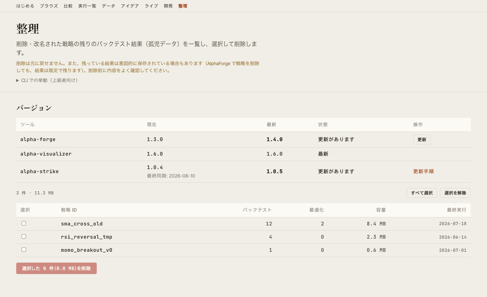

# alpha-visualizer v1.7.0 リリース — 各種ツールのバージョン確認と更新

> **公開日**: 2026 年 8 月 10 日 / **バージョン**: v1.7.0（本ノートは v1.7.1 のパッチを含む累積） / **配布**: [PyPI](https://pypi.org/project/alpha-visualizer/)・[GitHub Release](https://github.com/alforge-labs/alpha-visualizer/releases/tag/v1.7.0)

[alpha-visualizer](index.md) は、`alpha-forge` が出力するバックテスト結果を Web ブラウザで可視化するスタンドアロンの OSS パッケージです。v1.7.0 は、使っているツールが古いかどうかを GUI から判断できるようにするリリースです。

これまでバージョン情報は画面のあちこちに分散し、どれも「今入っている版」しか分かりませんでした。新しい版が出ているかどうかを知るには、それぞれのツールでコマンドを打つ必要がありました。

## ハイライト

### 1. バージョンの一覧

メンテナンス画面（`/maintenance`）に「バージョン」セクションが加わりました。alpha-forge / alpha-visualizer / alpha-strike の現在版と最新版が 1 つの表に並びます。

{ loading=lazy }

個別の照会に失敗したツールは、その行だけが「不明」と表示されます。他の行や画面全体には影響しません。オフラインや AlphaForge 未導入は「壊れた状態」ではなく想定内なので、画面を壊さない設計にしています。

### 2. GUI からの更新

更新がある行には「更新」ボタンが出ます。

- **alpha-forge** — [`alpha-forge self update --yes`](../cli-reference/self.md) に委譲します。ダウンロードの検証・スモークテスト・ロールバックは AlphaForge 側が行います
- **alpha-visualizer** — pip / uv による自己更新を実行します。**成功したときだけ**サーバーを自動で再起動し、画面が復帰します

進捗は実行中もリアルタイムで表示されます。

!!! warning "Windows では自己更新に対応していません"
    実行中の `alpha-vis.exe` がロックされ、pip がファイルを置換できないためです。Windows では更新コマンドの提示のみ行います。

### 3. alpha-strike は表示のみ

alpha-strike は稼働中の発注サーバーです。GUI から再起動させないため、更新ボタンは出さず、更新手順へのリンクのみ表示します。

表示されるバージョンは [`alpha-forge live sync-events`](../cli-reference/live.md) で同期された時点のもので、リアルタイムではありません。値がいつ時点のものかが分かるよう、画面には「最終同期」を併記します。

!!! note "alpha-strike v1.1.0 以降が必要です"
    バージョンの受け渡しは、alpha-strike が起動時に書き出すメタファイルを既存の同期経路で受け取る方式です。表示には [alpha-strike v1.1.0](https://github.com/alforge-labs/alpha-strike/releases/tag/v1.1.0) 以降を VM へ反映し、`alpha-forge live sync-events` を 1 回以上実行する必要があります。それまでは「不明」と案内が表示されます。

## 安全のための制限

更新の実行は **localhost からのみ**行えます。`--host 0.0.0.0` などで LAN へ公開している場合は無効です（認証を持たない API のため）。

alpha-visualizer の自己更新は、次のいずれかに当てはまると開始しません。

- ほかのジョブ（バックテスト・最適化・AI 戦略開発など）が実行中
- 開発用（editable）インストール
- pip も uv も使えない環境

## 改善

- **整理画面に言語・テーマの切り替えを追加しました。** 主要画面でこの画面だけ切り替え手段がなく、別の画面へ移動する必要がありました
- **ダークモードの配色が揃わない問題を修正しました。** OS のカラースキームがダークの場合、初回表示でライト用の配色が当たっていました

## 修正（v1.7.1）

- **EULA の再同意待ちが「不明」と表示される問題を修正しました。** AlphaForge は EULA が改訂されると再同意を求めます。GUI から alpha-forge を更新した直後は必ずこの状態を通りますが、バージョン欄は原因を示さず「未導入または実行に失敗」とだけ表示していました。v1.7.1 からは EULA 未同意である旨と、`alpha-forge system doctor` で同意する手順を案内します
- 併せて、ロケールが設定されていない環境（`LANG` 未設定など）で AlphaForge の呼び出しが文字コードエラーになる問題も修正しました

## アップグレード方法

```bash
# pip
pip install -U alpha-visualizer

# uv
uv tool upgrade alpha-visualizer

# pipx
pipx upgrade alpha-visualizer
```

v1.7.0 からは、メンテナンス画面の「更新」ボタンからも更新できます（Windows を除く）。

## 関連ドキュメント

- [機能詳細 — Maintenance 画面](features.md)
- [alpha-strike v1.1.0 リリース](https://github.com/alforge-labs/alpha-strike/releases/tag/v1.1.0)
